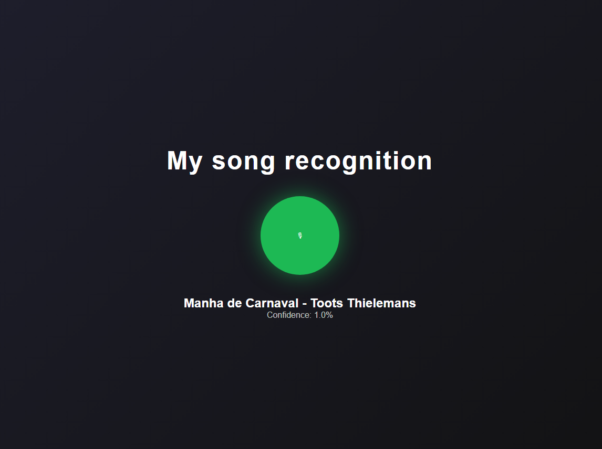

# My Song Recognition

A simplified audio fingerprinting system inspired by Shazam.  
Built using FastAPI, PostgreSQL and STFT-based spectral analysis.

The project demonstrates how digital signal processing and indexed SQL matching can be combined to build a basic music recognition backend.

---

## Application Preview


## Overview

The system implements a simplified fingerprinting pipeline:

1. Audio signal is transformed using Short-Time Fourier Transform (STFT).
2. Spectral peaks are extracted per time frame.
3. Peak frequency indices are converted into hash values.
4. Hashes with time offsets are stored in PostgreSQL.
5. Incoming audio fingerprints are matched using offset alignment.

This is an educational implementation and does not aim to replicate production-grade robustness.

---

## Architecture
### Fingerprint Generation

Audio is transformed using STFT (n_fft=2048).

For each time frame, peaks above 50% of the maximum magnitude are detected.

Each peak frequency index becomes a fingerprint hash.

Each fingerprint is stored as:

```python
(hash_value, time_offset)
```

This is a simplified approach compared to production-grade fingerprinting systems.

### Database Layer
Table Structure
```SQL
CREATE TABLE fingerprints (
    song_name TEXT,
    hash TEXT,
    time_offset INT
);
```

### Matching Strategy

Instead of performing thousands of individual SQL queries, the system performs a single query:

```SQL
SELECT song_name, time_offset, hash
FROM fingerprints
WHERE hash = ANY(:hashes);
```

All potential matches are fetched at once. Offset differences are then counted to determine the most consistent alignment, which identifies the best matching song.

An index on the hash column is required for performance:

```SQL
CREATE INDEX idx_hash ON fingerprints(hash);
```

### Microphone Recording
Configuration:
- Sample rate: 44100 Hz
- Mono
- Float32 format
- Chunk size: 1024
- The /listen endpoint:
- Records 1-second chunks
- Builds a 5-second sliding window
- Attempts recognition
- Stops after 20 seconds (timeout)

### API Endpoints
GET /
Returns a simple web interface with a microphone button.

GET /songs
Returns all indexed songs.

POST /index
Indexes a new uploaded song.

Parameters:
file: audio file
name: song name

Example response:
```JSON
{
  "status": "indexed",
  "fingerprints": 12345
}
```

POST /listen

Performs real-time recognition using the microphone.

Example response:
```JSON
{
  "detected_song": "Song Name",
  "score": 42,
  "confidence": 0.015
}
```

Confidence is calculated as:

```python
confidence = score / number_of_sample_fingerprints
```

POST /identify

Identifies an uploaded audio file using the same fingerprinting and matching pipeline.

Installation
1. Clone the Repository
git clone <repository_url>
cd <project_directory>
2. Install Dependencies
pip install -r requirements.txt

Required libraries include:
- fastapi
- uvicorn
- librosa
- numpy
- scipy
- pyaudio
- sqlalchemy
- psycopg2

3. Set Up PostgreSQL

Create database:
```cmd
createdb shazam
```

Create table:

```SQL
CREATE TABLE fingerprints (
    song_name TEXT,
    hash TEXT,
    time_offset INT
);
```

Create index for performance:

```SQL
CREATE INDEX idx_hash ON fingerprints(hash);
```

4. Run the Application
```cmd
uvicorn api:app --reload
```

Open in your browser:
```HTTP
http://127.0.0.1:8000
```

### Performance Improvements
Initial version suffered from request timeouts due to thousands of database queries executed in loops.

Optimizations implemented:
- Replaced per-hash queries with a single ANY() query
- Added index on hash
- Introduced sliding recognition window
- Added silence detection before analysis
These improvements significantly reduced latency and eliminated timeouts.

### Limitations
- This is an educational implementation:
- Hashes are based only on peak frequency index
- No peak pairing
- No time-delta hashing
- Limited robustness to noise
- Confidence score is heuristic

Production systems use:
- Constellation maps
- Peak pairing
- Time-delta hashing
- Noise-resistant fingerprinting

### Future Improvements
- Implement peak pairing and time-delta hashing
- Improve confidence scoring model
- Add background task processing
- Improve UI/UX
- Docker containerization
- Add automated tests

### Project Goals
This project demonstrates:
- Digital Signal Processing fundamentals
- Audio fingerprinting techniques
- Efficient SQL-based matching strategies
- Backend API design with FastAPI
- Real-time audio handling
- Practical performance optimization
It serves as a technical exploration of simplified audio recognition systems.

